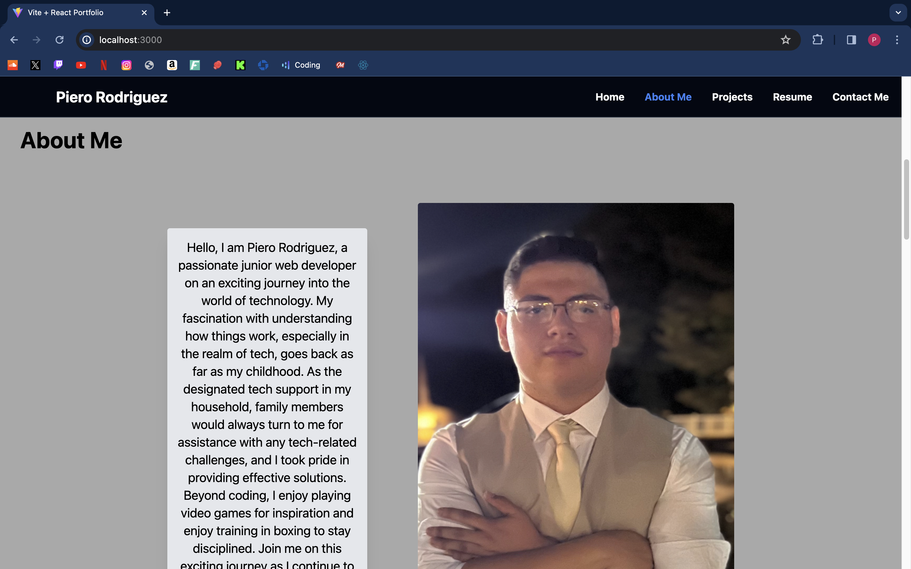
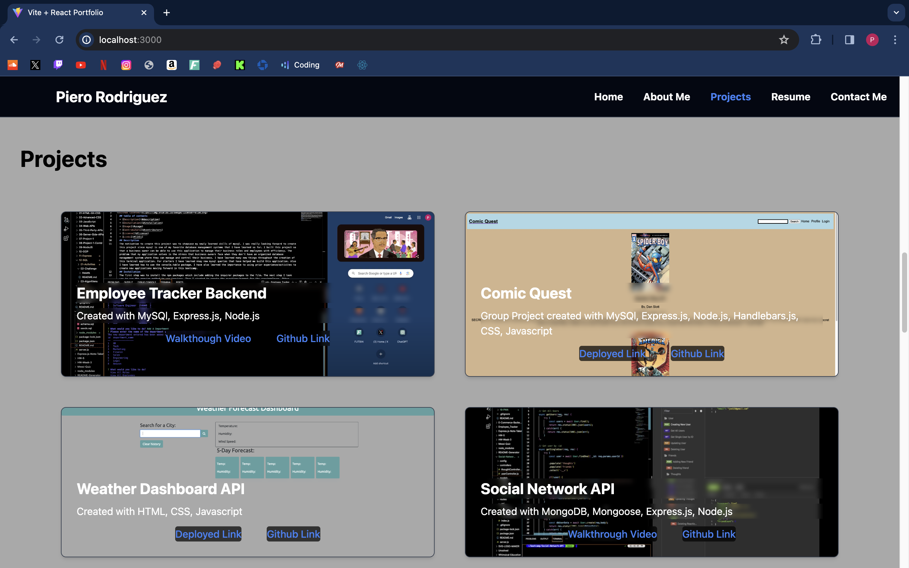
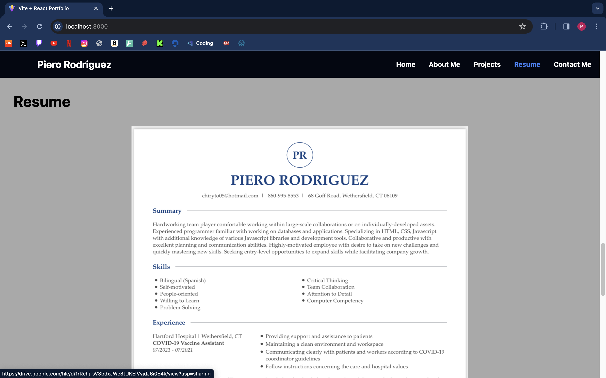
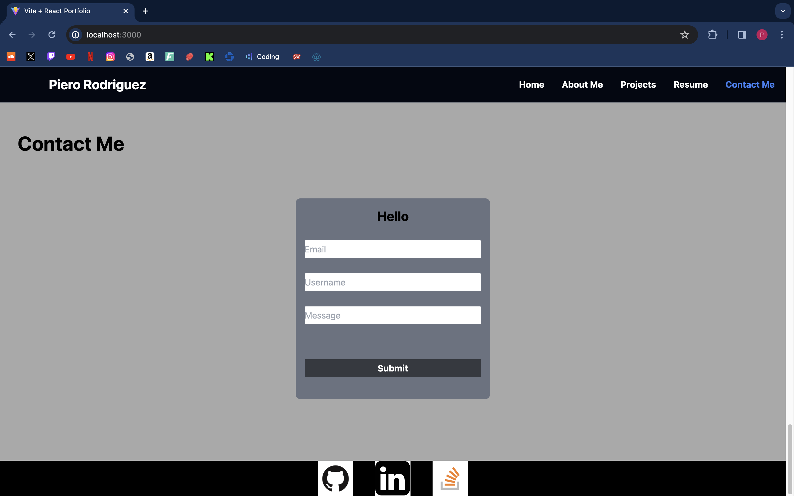

# React-Portfolio

## Description 

My motivation behind creating this React portfolio was to showcase my newly learned React skills to any potiential employers. I built this project so that employers could have somewhere to go to learn about me, see my resume, and take a look at some of the projects that I have done. The specific problem that my React portfolio solves is that it can be factor to recruters to see I would be a right fit for their comapny. I have learnt many new things throughout the creation of my React portfolio, one of those things being that React is much easier to do compareed to vanilla Javascript.  

## Installation 
The first step was to create a project with vite. Once the vite project was created we needed to connect it to a git remote by creating a git repository and connecting it to the vite project so that I could do my git commands without a problem between the vite project and the Github repository. The thrid step was to npm install all the packages needed for my React portfolio. The npm packages that I have used were react, reeact-dom, reacter-router-dom, reeact-scroll, and tailwindcss for my styling. Before deploying to Netlify I needed to add the environment variables file called _redirects in the public folder since Netlify defaults to using the public folder I needed to redirect it to start in the index.html file with a status of 200. 

## Usage 

# Home 

Once the user opens my portfolio they will be presented with a navbar and a big pictures and words that transition every 8 seconds. If they are on Home section then that section will be hightlighted blue. One important thing to mention is everytime the user clicks on one of the navbar tabs then they will be scrolled down with smooth scrolling caused by the react-scroll npm package.  

# About Me

If the user clicks on the About me section then they will be presented with a short description about me and a picture of me. If the user is actively on the About me page then that section will be hightlighted blue on the navbar. 

# Projects

If the user clicks on Project tab on the navbar then they will be presented with six of my projects. Four of the projects are deployed and 2 of teh projects are backend. The four projects that are deployed have links to the deployed version of the project and the link to the Github repoository. The two backend projects have links to the walkthrough video and have the link to the Github repository. If the user is actively on the Projects page then that section will be hightlighted blue on the navbar.

# Resume

If the user clicks on the Resume section on the navbar then they will be presented with my resume which the user can click on and they will be redirected to a viewable google drive pdf link where they can see the my resume more clearly and also have the ability to download my resume. If the user is actively on the Resume page then that section will be hightlighted blue on the navbar.

# Contact Me

If the user clicks on the Contact Me navbar section then they will be presented with a form and a small footer. The form is where the user can provide their email, username, and a message. If the user foregets to fill out one of the fields then they will get an error message saying that they need to fill out that specific field because all field of the form are required. Once the user fills out every field of the form then they will be greeted with a Hello and their username that the user provided. The footer contains three different ways the user can see more of what I do. The three ways are my Github profile, LinkedIn, and Stack Overflow. When the user clicks on one of the icons then they will be redirected to that specifc platform where they can view my profile. 

## Credits
  Piero Rodriguez(Me) https://github.com/Piero9992023

  ## License
  https://opensource.org/licenses/

  ## Links
  Github Link: https://github.com/Piero9992023/Official-React-Portfolio
  Deployed Link: https://pierocodes.netlify.app/